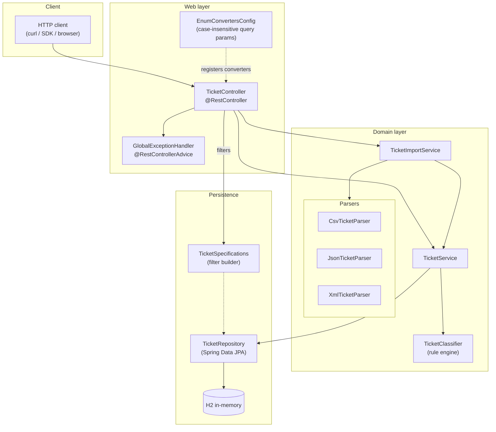
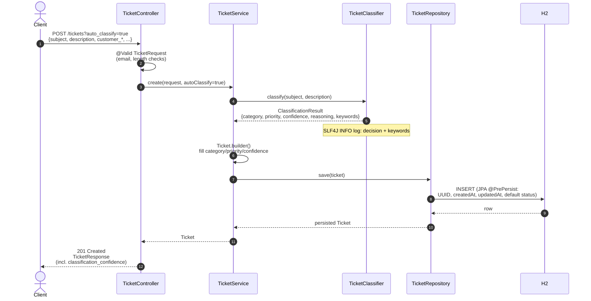
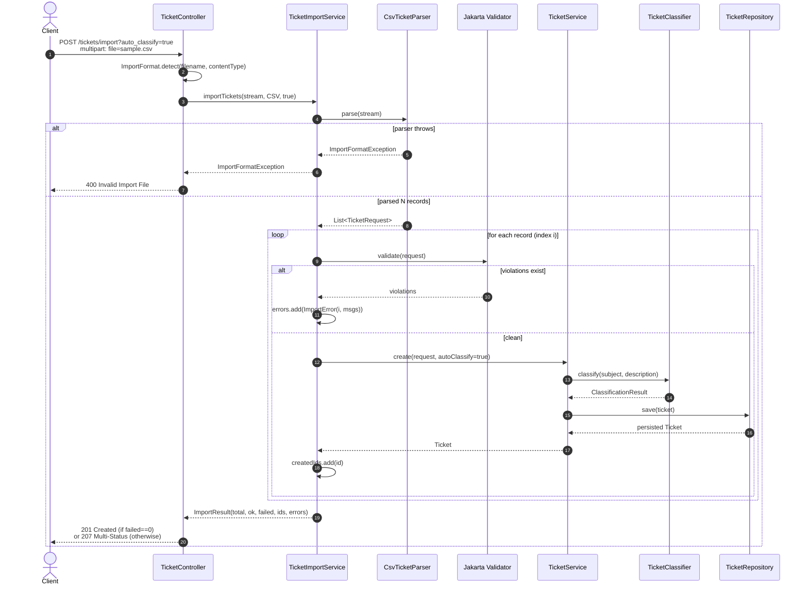

# Architecture

> Audience: technical leads and reviewers. Walks the high-level shape of the
> service, the runtime flows for the two most important endpoints, and the
> design trade-offs that shaped them.

---

## 1. High-Level Components

### Component responsibilities

| Component | Responsibility |
|---|---|
| `TicketController` | HTTP shape, status codes, multipart handling, query-param-to-filter mapping. No business logic. |
| `GlobalExceptionHandler` | Single source of truth for the error response envelope (`ErrorResponse`). Maps `TicketNotFoundException`, validation failures, malformed bodies, missing parts, type mismatches, and `ImportFormatException` to specific HTTP codes. |
| `EnumConvertersConfig` | `ConverterFactory<String, Enum>` so `?priority=high` (lowercase, as in JSON) binds correctly. |
| `TicketService` | CRUD, transactional boundary, classification when `auto_classify=true` on create, **manual-override semantics** (PUT clears `classification_confidence` if category/priority changed). |
| `TicketImportService` | Format dispatch (CSV/JSON/XML), per-record validation via Jakarta `Validator`, error accumulation. Delegates persistence to `TicketService`. |
| `TicketClassifier` | Rule-based: scans `subject + description` against keyword lists per category and per priority. Returns category, priority, confidence (0–1), reasoning, matched keywords. Logs every decision via SLF4J. |
| `Csv/Json/XmlTicketParser` | Each implements `TicketImportParser`. They produce `List<TicketRequest>` from a raw `InputStream`; parser-internal errors are wrapped as `ImportFormatException`. |
| `TicketRepository` + `TicketSpecifications` | `JpaRepository` + `JpaSpecificationExecutor` with a one-method `Specification` builder for the filter combination (`AND` of optional predicates). |

---

## 2. Sequence: Create with auto-classification

Failure paths:
- Validation fails → `MethodArgumentNotValidException` → `GlobalExceptionHandler` → `400` with `field_errors`.
- `auto_classify=false` and category/priority missing → `IllegalArgumentException` from `requireField()` → `400`.

---

## 3. Sequence: Bulk import (CSV) with `auto_classify=true`

The loop is per-record; one bad row does not abort the batch.

---

## 4. Design Decisions and Trade-offs

### Rule-based classifier instead of an LLM call

- The Task 2 spec lists explicit keyword phrases for each category/priority. Implementing them literally is deterministic, testable, free, and zero-latency.
- A pluggable interface (`classify(subject, description) → ClassificationResult`) keeps an LLM-backed implementation as a future drop-in without touching callers.
- Confidence is a linear function of the matched-keyword count (`0.3 + 0.2 × signals`, capped at `1.0`), with a floor of `0.2` for no-match cases. The spec doesn't require a calibrated probability; this is enough for "more matches → higher confidence".

### Manual override clears `classification_confidence`

- Whenever `PUT /tickets/{id}` changes `category` or `priority`, the stored confidence is set to `null`.
- This is the cheapest way to encode "the human has the floor": consumers can treat `classification_confidence == null` as "manually curated" without a second flag.

### Optional `auto_classify` on create / import

- Default is **off**: validation enforces `category` and `priority`. This keeps `POST /tickets` strict and unsurprising.
- Auto-classify is opt-in via query param, so the same endpoint serves both supervised and unsupervised callers without a separate URL.

### Bulk import returns partial success

- A 50-row CSV with two invalid rows shouldn't 4xx the whole batch — that wastes the 48 valid rows.
- The `ImportResult` envelope carries per-record errors with `record_index`, so clients can re-submit only the failures.
- HTTP code is `201 Created` when `failed == 0`, else `207 Multi-Status` — explicit signal without abusing 4xx.

### Snake_case JSON

- The Task 1 model spec uses snake_case (`customer_id`, `created_at`, …) — kept on the wire via `spring.jackson.property-naming-strategy=SNAKE_CASE`.
- Java fields stay camelCase; the boundary only flips at (de)serialization.

### Specifications over query-DSL

- Filtering by 0–5 optional fields is a textbook `JpaSpecificationExecutor` case.
- Each predicate is independently nullable, glued together with `AND`. No room for a query-builder library.

### H2 in-memory by choice

- Spec calls for it. Trivial to swap for Postgres later: change `pom.xml` driver + `application.properties` URL.
- JPA + `ddl-auto=update` handles schema bootstrap.

### Lombok with `@Generated` for coverage

- `lombok.config` sets `lombok.addLombokGeneratedAnnotation = true`, which makes JaCoCo skip generated accessors/builders. Without this, project coverage was 41% (mostly synthetic getters); with it, real-code coverage is 93%.

---

## 5. Cross-cutting Concerns

### Validation

- **Web boundary**: Jakarta Bean Validation via `@Valid` on `TicketRequest`. Failures are caught by `GlobalExceptionHandler.handleValidation` and rendered as `field_errors`.
- **Import path**: same validator invoked programmatically per record. Violations are converted to `ImportError` rows and do not abort the batch.
- **Service layer**: `requireField` enforces "category/priority required unless auto_classify".

### Transactions

- `TicketService` methods are `@Transactional` (writes) or `@Transactional(readOnly=true)` (reads).
- `TicketImportService.importTickets` itself is *not* transactional — each record's `create` is its own transaction. This is intentional: a single bad row should not roll back the rest.

### Logging

- Default Spring Boot console logging.
- `TicketClassifier` emits one INFO line per decision with category, priority, confidence, matched keywords, and reasoning. This is the audit trail required by Task 2 ("Log all decisions").

### Error model

- One envelope (`ErrorResponse`) used by every `@ExceptionHandler`. Consumers parse one shape.
- Generic `Exception` handler returns 500 as a last resort — kept narrow on purpose.

---

## 6. Performance Considerations

### Today

- Single-process Spring Boot + in-memory H2: latency is bound by the JVM warm-up and JPA overhead.
- Tags are stored in a side table via `@ElementCollection` (`ticket_tags`) — fine for read patterns; could be denormalized to JSON if write throughput grows.

### Tomorrow (not implemented; sketched)

- Swap H2 for Postgres. Index on `category`, `priority`, `status` for the listing endpoint.
- Wrap `Cache-Control: private, max-age=...` on `GET /tickets/{id}` if list patterns warrant.
- Move bulk import to async (`@Async` or a queue) once batches exceed ~10k rows.

---

## 7. Security Notes

The current build is **not production-secure** — it is a homework artifact. Items that would need work for real deployment:

- No authentication / authorization. Every endpoint is open.
- Open H2 console at `/h2-console` (default credentials).
- Multipart upload size limited via `spring.servlet.multipart.max-file-size=10MB` — but no antivirus or schema deep-validation beyond what the parsers reject.
- No CORS configuration; allow-list would be needed for browser clients.
- Generic `handleAny` exception path leaks `Exception.message` into the response — fine for development, would be redacted in production.

---

This document was drafted with Claude Opus 4.7. The two sequence diagrams and the component graph are Mermaid; render in GitHub or any Mermaid-aware viewer.
