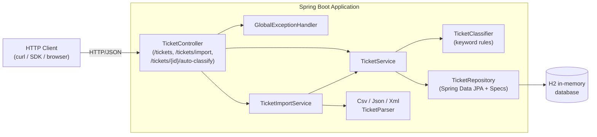

🎧 Homework 2: Intelligent Customer Support System

> **Student Name**: Oleksandr Tsiupa
> **Date Submitted**: 2026-05-17
> **AI Tools Used**: Claude Code

# Intelligent Customer Support Ticket Management API

A Spring Boot REST service that ingests support tickets from multiple file formats
(CSV / JSON / XML), auto-classifies them by category and priority using a
rule-based engine, and exposes a CRUD API backed by an in-memory H2 database.

Homework 2 of the **AI-Assisted Development** course.

---

## Features

- **CRUD API** for support tickets with filtering by category, priority, status, customer.
- **Bulk import** from CSV, JSON, and XML with per-record validation and partial-success reporting (HTTP `207 Multi-Status`).
- **Auto-classification** of category (`account_access`, `technical_issue`, `billing_question`, `feature_request`, `bug_report`, `other`) and priority (`urgent`, `high`, `medium`, `low`) — keyword-based, returns confidence + reasoning + matched keywords.
- **Snake_case JSON** payloads end-to-end (request and response).
- **In-memory H2** with the H2 console at `/h2-console`.
- **Test suite**: 56 unit + integration tests (JUnit 5, Mockito, REST Assured) at **93% line coverage** (JaCoCo); plus a separate **E2E module** (`e2e/`) with 12 Groovy/Spock black-box scenarios that target a live running instance.

---

## Architecture



For deeper component descriptions, sequence diagrams, and design rationale see
[docs/ARCHITECTURE.md](ARCHITECTURE.md).

---

## Tech Stack

| Concern | Choice |
|---|---|
| Language | Java 17 (built/tested under JDK 21 too) |
| Framework | Spring Boot 3.2.5 (Web, Data JPA, Validation) |
| Database | H2 (in-memory) |
| CSV / JSON / XML | OpenCSV, Jackson, Jackson-XML |
| Build | Maven |
| Tests | JUnit 5, Mockito, AssertJ, REST Assured |
| Coverage | JaCoCo (target >85%, currently 93%) |
| Boilerplate | Lombok |

---

## Prerequisites

- JDK 17 or newer (project is built with Java 17 source level; JDK 21 works for runtime)
- Maven 3.9+ (no Maven wrapper is included — `mvn` must be on your `PATH`)

---

## IDE Setup

**IntelliJ IDEA (recommended)**

1. Open the `homework-2/` directory as a Maven project.
2. Install the **Lombok** plugin: *Settings → Plugins → search "Lombok" → Install*.
3. Enable annotation processing: *Settings → Build, Execution, Deployment → Compiler → Annotation Processors → Enable annotation processing*.
4. Reload the Maven project (`pom.xml` → "Load Maven Changes") — generated getters/setters/builders will resolve correctly.

> Without steps 2–3 the IDE will show red errors on every Lombok-annotated class even though `mvn compile` succeeds on the command line.

**VS Code**

Install the [Extension Pack for Java](https://marketplace.visualstudio.com/items?itemName=vscjava.vscode-java-pack); Lombok support is bundled via `lombok-support`.

---

## Build and Run

```bash
# build a runnable jar (skips tests)
mvn -DskipTests package

# run the application (port 8080)
java -jar target/support-api-1.0.0.jar

# alternative: run via Maven plugin
mvn spring-boot:run
```

Once up, the service answers on `http://localhost:8080`. H2 console is available at
`http://localhost:8080/h2-console` (JDBC URL `jdbc:h2:mem:supportdb`, user `sa`, no password).

> **Note:** The H2 console has no authentication — it is intentionally open for local development only. Do not deploy this configuration to a shared or public environment.

**Useful development toggles** (override in `application.properties` or via `-D` JVM arg):

```properties
# See every SQL statement Spring executes
spring.jpa.show-sql=true

# Increase import file size limit beyond the default 10 MB
spring.servlet.multipart.max-file-size=50MB
spring.servlet.multipart.max-request-size=50MB
```

Quick smoke test:

```bash
curl -s -X POST "http://localhost:8080/tickets?auto_classify=true" \
  -H "Content-Type: application/json" \
  -d '{
    "customer_id": "C-1",
    "customer_email": "alice@example.com",
    "customer_name": "Alice",
    "subject": "Cannot login",
    "description": "Cant access my account, this is critical."
  }'
```

See [docs/API_REFERENCE.md](API_REFERENCE.md) for every endpoint with examples.

---

## Running Tests

```bash
# unit + integration (REST Assured) tests
mvn test

# specific suite
mvn -Dtest='TicketApiTest' test
mvn -Dtest='TicketCrudIT' test

# coverage report: target/site/jacoco/index.html
mvn test && open target/site/jacoco/index.html
```

Full QA guide: [docs/TESTING_GUIDE.md](TESTING_GUIDE.md).

### E2E tests (requires a running instance)

The `e2e/` directory is a standalone Maven project (Groovy + Spock + REST Assured) that runs
black-box scenarios against an already-running application. Tests clean up after themselves
by deleting the tickets they created — no database reset is needed.

```bash
# 1. Start the application first (in a separate terminal)
mvn -DskipTests spring-boot:run

# 2. Run all E2E scenarios against localhost:8080 (default)
cd e2e && mvn test

# Run against a different host
cd e2e && mvn test -Dapi.base-url=http://staging.example.com
```

### Load tests (requires a running instance)

The `load/` directory is a standalone Maven project (Gatling 3.9 · Java DSL) that measures
throughput and latency under concurrent load. Two simulations are provided:

| Simulation | What it does |
|---|---|
| `ConcurrentOperationsSimulation` | 25 simultaneous CRUD users + 10 simultaneous read-only users (35 concurrent requests at t=0) |
| `CombinedFilterSimulation` | Seeds 30 tickets then fires 25 concurrent users querying by combined `category` + `priority` filters |

```bash
# 1. Start the application first (in a separate terminal)
mvn -DskipTests spring-boot:run

# 2. Run both simulations
cd load && mvn gatling:test

# Run a single simulation
cd load && mvn gatling:test \
  -Dgatling.simulationClass=com.support.api.load.ConcurrentOperationsSimulation

cd load && mvn gatling:test \
  -Dgatling.simulationClass=com.support.api.load.CombinedFilterSimulation

# Run against a different host
cd load && mvn gatling:test -Dapi.base-url=http://staging.example.com
```

Gatling writes an HTML report to `load/target/gatling/<simulation-timestamp>/index.html` after
each run.

---

## Project Structure

```
homework-2/
├── README.md
├── API_REFERENCE.md
├── ARCHITECTURE.md
├── TESTING_GUIDE.md
├── TASKS.md                   # homework task checklist (not a dev doc)
├── pom.xml
├── lombok.config              # sets addLombokGeneratedAnnotation=true so JaCoCo skips Lombok code
├── demo/                      # scratch space for demo files / ad-hoc test payloads
├── e2e/                       # standalone Groovy/Spock E2E module (separate Maven project)
├── load/                      # standalone Gatling load-test module (separate Maven project)
│   └── src/test/java/com/support/api/load/
│       ├── ConcurrentOperationsSimulation.java
│       └── CombinedFilterSimulation.java
├── docs/
│   └── screenshots/
└── src/
    ├── main/
    │   ├── java/com/support/api/
    │   │   ├── SupportApiApplication.java
    │   │   ├── config/        # WebMvc converters
    │   │   ├── controller/    # REST controllers
    │   │   ├── dto/           # request/response/import DTOs
    │   │   ├── exception/     # @RestControllerAdvice + ErrorResponse
    │   │   ├── model/         # JPA entity, enums, embeddable
    │   │   ├── repository/    # Spring Data JPA + JpaSpecifications
    │   │   └── service/
    │   │       ├── classifier/  # TicketClassifier (rule-based)
    │   │       └── importer/    # Csv/Json/Xml parsers + dispatcher
    │   └── resources/
    │       └── application.properties
    └── test/
        ├── java/com/support/api/
        │   ├── controller/    # @WebMvcTest + Mockito
        │   ├── integration/   # REST Assured IT (Task 1 + Task 2)
        │   ├── model/         # entity + validation tests
        │   └── service/       # parser + classifier unit tests
        └── resources/fixtures/  # CSV/JSON/XML samples + malformed
```

---

## Documentation Map

| File | Audience | What's inside |
|---|---|---|
| `README.md` (this file) | Developers | Quickstart, architecture overview, run instructions |
| [`API_REFERENCE.md`](API_REFERENCE.md) | API consumers | Endpoints, schemas, errors, cURL examples |
| [`ARCHITECTURE.md`](ARCHITECTURE.md) | Tech leads | Components, sequence diagrams, design decisions |
| [`TESTING_GUIDE.md`](TESTING_GUIDE.md) | QA engineers | Pyramid, fixtures, manual checklist, coverage |
| [`TASKS.md`](TASKS.md) | Course graders | Homework task checklist and completion notes |

---

<sub>This document was drafted with Claude Opus 4.7. See per-doc footers for the model behind each file.</sub>
