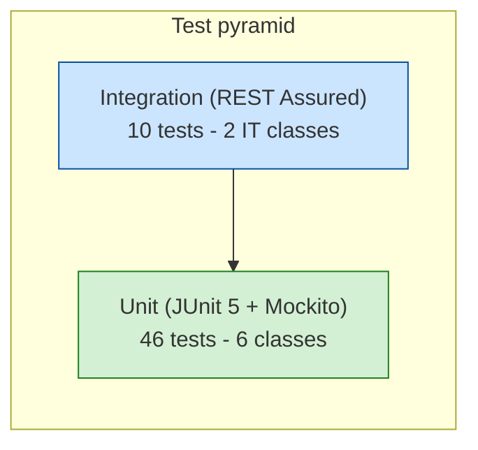

# Testing Guide

> Audience: QA engineers. Covers the test pyramid, how to run each layer,
> where the fixtures live, and a manual checklist for exploratory testing.

---

## Test Pyramid



| Layer | Count | What runs | Speed |
|---|---|---|---|
| **Unit** | 46 | JUnit 5 + Mockito (and `@WebMvcTest` for the controller) | ~5–10 s total |
| **Integration** | 10 | REST Assured against `@SpringBootTest(RANDOM_PORT)` with real H2 | ~25–30 s per IT class |

Total in-process tests: **56**. JaCoCo line coverage: **93%**, branch coverage: **76%**.

---

## How to run

### All unit + integration tests

```bash
cd homework-2
mvn test
```

Surefire is configured to pick up both `*Test.java` (unit) and `*IT.java` (integration).

### A specific test class

```bash
mvn -Dtest='TicketApiTest' test
mvn -Dtest='TicketCrudIT' test
mvn -Dtest='CategorizationTest#urgentPriority' test
```

### Coverage report

JaCoCo runs in the `test` phase. Open the HTML report after a run:

```bash
mvn test
open target/site/jacoco/index.html
```

The CSV/XML variants are at `target/site/jacoco/jacoco.csv` and `jacoco.xml`.

---

## Test layout

```
src/test/java/com/support/api/
├── controller/
│   └── TicketApiTest.java          # 11 tests — @WebMvcTest + Mockito @MockBean
├── model/
│   └── TicketModelTest.java        # 9 tests — entity lifecycle, enums, validation
├── service/
│   ├── classifier/
│   │   └── CategorizationTest.java # 10 tests — every category + every priority
│   └── importer/
│       ├── CsvImportTest.java      # 6 tests
│       ├── JsonImportTest.java     # 5 tests
│       └── XmlImportTest.java      # 5 tests
└── integration/
    ├── TicketCrudIT.java           # 5 IT — Task 1 (CRUD + bulk import + filtering)
    └── TicketAutoClassifyIT.java   # 5 IT — Task 2 (auto-classify on create / import / endpoint)
```

### Fixtures

`src/test/resources/fixtures/`:

| File | Records | Used by |
|---|---|---|
| `sample_tickets.csv` | 6 valid rows covering every category | `TicketCrudIT.csvBulkImportSuccess` |
| `sample_tickets.json` | 5 valid records | `TicketCrudIT`, auto-classify IT |
| `sample_tickets.xml` | 5 valid records | `TicketCrudIT.xmlBulkImportAndMalformed` |
| `malformed.csv` | (broken) | Negative test |
| `malformed.json` | (broken) | Negative test |
| `malformed.xml` | (broken) | `TicketCrudIT.xmlBulkImportAndMalformed` |

Inline fixtures (Java text blocks) are used inside unit tests where the data is small and tightly coupled to the assertion.

---

## Manual Testing Checklist

A 10-minute smoke run before submission or merging. Assume `http://localhost:8080`.

### CRUD basics
- [ ] `POST /tickets` returns **201** and the body has `id`, `created_at`, `updated_at`, default `status: "new"`.
- [ ] `POST /tickets` with `customer_email: "not-an-email"` returns **400** with `field_errors[].field == "customerEmail"`.
- [ ] `POST /tickets` with `description: "short"` returns **400**.
- [ ] `GET /tickets/{id}` returns **200** for an existing id, **404** for a fresh random UUID.
- [ ] `PUT /tickets/{id}` with `status: "resolved"` populates `resolved_at`.
- [ ] `DELETE /tickets/{id}` returns **204** then a subsequent `GET` returns **404**.

### Filtering
- [ ] `GET /tickets?priority=high` (lowercase) returns only high-priority tickets.
- [ ] `GET /tickets?priority=NOT_VALID` returns **400** with `"message": "...priority..."`.
- [ ] `GET /tickets?category=billing_question&customer_id=C-1` AND-combines the filters.

### Bulk import
- [ ] `POST /tickets/import` with `sample_tickets.csv` returns **201** and `successful: 6, failed: 0`.
- [ ] `POST /tickets/import` with a JSON payload containing one invalid row returns **207** with `errors[0].record_index`.
- [ ] `POST /tickets/import` with `malformed.xml` returns **400 Invalid Import File`.
- [ ] `POST /tickets/import` without the `file` part returns **400** with `"message": "...file..."`.

### Auto-classification
- [ ] `POST /tickets?auto_classify=true` with `subject: "Cannot login"`, `description: "cant access ... critical"` returns **201** with `category: "account_access"`, `priority: "urgent"`, and a numeric `classification_confidence`.
- [ ] `POST /tickets` without `auto_classify` and no `category` returns **400** with `"message": "...category..."`.
- [ ] `POST /tickets/{id}/auto-classify` on a "production environment is down ... security" ticket returns **200** with `priority: "urgent"`, `keywords_found` including `"security"`.
- [ ] `PUT /tickets/{id}` with a *different* category clears `classification_confidence` (next `GET` shows it as missing from the JSON).
- [ ] `PUT /tickets/{id}` with the *same* category/priority preserves `classification_confidence`.

### Imports + classifier together
- [ ] `POST /tickets/import?auto_classify=true` with `sample_tickets.json` returns **201** and every saved ticket has a non-null `classification_confidence`.

---

## Tips and Gotchas

- **REST Assured IT classes share H2 in-memory state with the running app, but each test method clears the repository in `@BeforeEach`.** If you ever see a test pass in isolation and fail in a batch, check whether you added an integration test without resetting state.
- **`classification_confidence` is `null` after a manual category change.** Tests assert this via `body("classification_confidence", nullValue())` — Jackson omits `null` fields (`spring.jackson.default-property-inclusion=non_null`), so REST Assured's `nullValue()` matcher works on the missing-key case too.
- **JaCoCo will report 41 % if `lombok.config` is missing or out-of-date.** The file flips on `@Generated` annotations so the coverage agent skips Lombok-emitted methods. A clean rebuild may be needed (`mvn clean test`) after editing it.

---

<sub>This document was drafted with Claude Opus 4.7.</sub>
