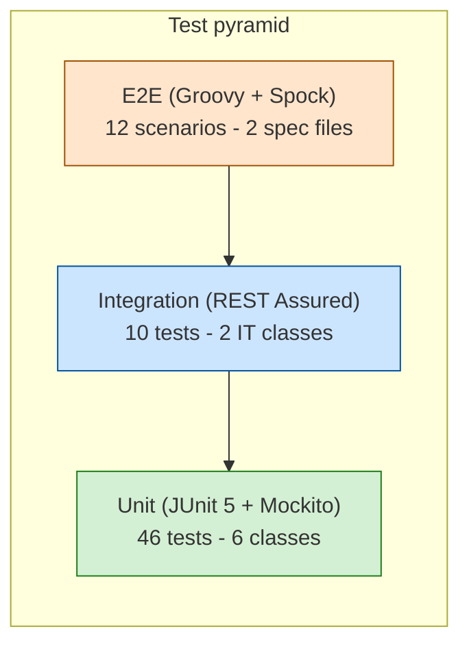

# Testing Guide

> Audience: QA engineers. Covers the test pyramid, how to run each layer,
> where the fixtures live, and a manual checklist for exploratory testing.

---

## Test Pyramid



| Layer | Count | What runs | Speed |
|---|---|---|---|
| **Unit** | 46 | JUnit 5 + Mockito; controller slice uses `@WebMvcTest` + MockMvc (no network) | ~5–10 s total |
| **Integration** | 10 | REST Assured against a real embedded server (`@SpringBootTest(RANDOM_PORT)`) with real H2 | ~25–30 s per IT class |
| **E2E** | 12 | Groovy/Spock + REST Assured against an externally-running app; no Spring context, no database reset | ~10–20 s (network-bound) |

> **MockMvc vs REST Assured** — `TicketApiTest` (`@WebMvcTest`) never starts an HTTP server; it exercises Spring MVC dispatch in-process with all downstream services mocked via `@MockBean`. The two IT classes (`TicketCrudIT`, `TicketAutoClassifyIT`) start a real embedded Tomcat on a random port and hit it over localhost with REST Assured — no mocking, real database.

Total in-process tests: **56**. E2E scenarios (separate module): **12**. JaCoCo line coverage: **93%**, branch coverage: **76%**.

---

## How to run

### All unit + integration tests

```bash
cd homework-2
mvn test
```

Surefire is configured to pick up both `*Test.java` (unit) and `*IT.java` (integration).

### E2E tests

The `e2e/` directory is a standalone Maven project — it must be run separately and requires the
application to be listening at `http://localhost:8080` (or an override URL).

```bash
# Start the application first (in a separate terminal)
cd homework-2 && mvn -DskipTests spring-boot:run

# Run all E2E scenarios
cd homework-2/e2e && mvn test

# Run against a remote host
cd homework-2/e2e && mvn test -Dapi.base-url=http://staging.example.com

# Run a single spec
cd homework-2/e2e && mvn -Dtest='TicketLifecycleSpec' test
```

### A specific test class

```bash
mvn -Dtest='TicketApiTest' test
mvn -Dtest='TicketCrudIT' test
mvn -Dtest='CategorizationTest#urgentPriority' test
```

### Coverage report

JaCoCo runs in the `test` phase. Open the HTML report after a run:

```bash
mvn test
open target/site/jacoco/index.html
```

The CSV/XML variants are at `target/site/jacoco/jacoco.csv` and `jacoco.xml`.

---

## Test layout

```
src/test/java/com/support/api/
├── controller/
│   └── TicketApiTest.java          # 11 tests — @WebMvcTest + Mockito @MockBean
├── model/
│   └── TicketModelTest.java        # 9 tests — entity lifecycle, enums, validation
├── service/
│   ├── classifier/
│   │   └── CategorizationTest.java # 10 tests — every category + every priority
│   └── importer/
│       ├── CsvImportTest.java      # 6 tests  — inline string fixtures
│       ├── JsonImportTest.java     # 5 tests  — inline string fixtures
│       └── XmlImportTest.java      # 5 tests  — inline string fixtures
└── integration/
    ├── TicketCrudIT.java           # 5 IT — Task 1 (CRUD + bulk import + filtering)
    └── TicketAutoClassifyIT.java   # 5 IT — Task 2 (auto-classify on create / import / endpoint)

e2e/src/test/groovy/com/support/api/e2e/
├── BaseE2ESpec.groovy                  # abstract base — REST Assured setup + per-test cleanup
├── TicketLifecycleSpec.groovy          # 5 scenarios — lifecycle, re-classify, filters, validation
└── BulkImportAutoClassifySpec.groovy   # 7 scenarios — all import formats + partial-success + malformed
```

### What each test class covers

**`TicketApiTest`** — HTTP layer only; all services are mocked.

| Test method | Scenario |
|---|---|
| `postCreatesTicket` | `POST /tickets` → 201 with `id` in body |
| `postRejectsInvalidEmail` | invalid email → 400 with `field_errors[].field == "customerEmail"` |
| `postRejectsShortDescription` | short description → 400; also covers malformed JSON body → 400 |
| `postAutoClassifyOmitsCategory` | `?auto_classify=true` with no category → 201 (category not required) |
| `getListsTickets` | `GET /tickets` → 200, list body |
| `getListsWithFilter` | query params bind to `TicketFilter`; invalid enum → 400 with `message` containing "priority" |
| `getsById` | `GET /tickets/{id}` → 200 with `customer_id` |
| `getsMissing404` | `GET /tickets/{id}` for unknown id → 404 |
| `putUpdates` | `PUT /tickets/{id}` → 200 with `id` |
| `deletesAndMissing` | `DELETE /tickets/{id}` → 204; delete again → 404 |
| `autoClassifyAndImport` | `POST /{id}/auto-classify` → 200; import success → 201; missing `file` part → 400; unknown extension → 400 "Invalid Import File" |

**`TicketModelTest`** — no Spring context; uses raw JPA lifecycle + Jakarta Validator.

| Test method | Scenario |
|---|---|
| `builderPopulatesEntity` | Lombok builder sets fields; `tags` defaults to empty list |
| `prePersistAssignsDefaults` | `@PrePersist` auto-generates UUID, `createdAt`, `updatedAt`, `status=NEW` |
| `preUpdateSetsResolvedAt` | `@PreUpdate` bumps `updatedAt`; sets `resolvedAt` when `status==RESOLVED` |
| `categoryFromJsonCaseInsensitive` | `@JsonCreator` accepts both `"BILLING_QUESTION"` and `"billing_question"` |
| `priorityToJsonLowercase` | `@JsonValue` emits `"urgent"`, `"medium"` |
| `statusFromJsonRejectsUnknown` | `"NOT_A_STATUS"` → `InvalidFormatException` |
| `requestRejectsInvalidEmail` | `@Email` constraint fires on bad email |
| `requestRejectsSubjectTooLong` | subject > 200 chars fails `@Size` |
| `requestRejectsDescriptionTooShort` | description < 10 chars fails `@Size` |

**`CategorizationTest`** — instantiates `TicketClassifier` directly; no Spring.

| Test method | Scenario |
|---|---|
| `accountAccessFromLogin` | "Cannot login" / "password" → `account_access` |
| `technicalIssueFromError` | "error" / "not working" → `technical_issue` |
| `billingFromInvoice` | "invoice" / "refund" / "charge" → `billing_question` |
| `featureRequestFromWouldLove` | "would love" / "feature" → `feature_request` |
| `bugReportFromSteps` | "steps to reproduce" / "regression" → `bug_report` |
| `urgentPriority` | "critical" + "security" → `urgent` |
| `highPriority` | "important" / "blocking" / "asap" → `high` |
| `lowPriority` | "minor" / "cosmetic" / "suggestion" → `low` |
| `mediumDefault` | no priority keywords → `medium` |
| `resultMetadata` | confidence in (0, 1], reasoning non-blank, keywords non-empty; full no-match → `other`/`medium`, reasoning contains "no category keywords matched" |

> **Known gap**: there is no dedicated test for the `other` category triggered by a positive keyword match — the `other` fallback is only exercised via the no-match path in `resultMetadata`.

**`CsvImportTest` / `JsonImportTest` / `XmlImportTest`** — instantiate parsers directly; use inline Java text-block strings, **not** the fixture files.

| Class | Scenarios covered |
|---|---|
| `CsvImportTest` | valid header row; semicolon-delimited `tags`; metadata columns; missing optional fields tolerated; invalid enum → `ImportFormatException`; mismatched column count → `ImportFormatException` |
| `JsonImportTest` | valid array; snake_case field mapping; nested `metadata`; unknown fields ignored; malformed JSON → `ImportFormatException` |
| `XmlImportTest` | multiple `<ticket>` elements; nested `<tags>`; `<metadata>` block; empty `<tickets/>` → empty list; malformed XML → `ImportFormatException` |

**`TicketCrudIT`** — full application context, real H2; `@BeforeEach` calls `repository.deleteAll()`.

| Test method | Scenario |
|---|---|
| `crudLifecycle` | POST → GET → PUT (status=resolved, `resolved_at` populated) → DELETE → 404 |
| `csvBulkImportSuccess` | `sample_tickets.csv` → 201, `successful:6, failed:0`; subsequent `GET /tickets` returns 6 items |
| `jsonBulkImportPartial` | 2-record JSON: 1 valid + 1 invalid → 207, `errors[0].record_index=1` |
| `xmlBulkImportAndMalformed` | `sample_tickets.xml` → 201, `successful:5`; then `malformed.xml` → 400 |
| `listingWithFilters` | imports CSV; asserts `?priority=urgent` ≥ 2 hits; `?category=account_access&priority=urgent` → CSV-1 only; `?customer_id=CSV-4` → feature_request; `?status=new` → 6; `?priority=high` → CSV-2 |

**`TicketAutoClassifyIT`** — full application context, real H2; `@BeforeEach` calls `repository.deleteAll()`.

| Test method | Scenario |
|---|---|
| `fullLifecycleWithAutoClassify` | create with `?auto_classify=true`, no category/priority → 201 with `category=account_access`, `priority=urgent`, `classification_confidence > 0`; GET; DELETE |
| `bulkImportWithAutoClassify` | JSON import `?auto_classify=true` → IT-A gets `billing_question`/`high`; IT-B gets `feature_request`/`low` |
| `reclassifyExisting` | create manually; `POST /{id}/auto-classify` → `priority=urgent`, `keywords_found` contains "security"; subsequent GET reflects new priority |
| `manualOverrideClearsConfidence` | auto-classify on create; PUT with different category → GET shows `classification_confidence` absent from JSON |
| `validationWithoutAutoClassify` | POST without `auto_classify` and missing category → 400 with message containing "category"; DB stays empty |

---

## E2E Tests (`e2e/` module)

The `e2e/` directory is a separate Maven project (`support-api-e2e`) written in **Groovy + Spock
Framework** with REST Assured for HTTP assertions. Unlike the integration tests, E2E specs:

- **Require the application to be running** — no `@SpringBootTest`, no embedded server.
- **Clean up via DELETE** — `BaseE2ESpec.cleanup()` deletes every ticket created during the test
  by tracking IDs in a list; no `repository.deleteAll()` call.
- **Can target any host** — override `api.base-url` to point at staging or any remote environment.

### `TicketLifecycleSpec` (5 scenarios)

| Scenario | What is verified |
|---|---|
| Complete status-machine walk | `new → in_progress → waiting_customer → resolved → DELETE → 404`; `resolved_at` populated only on resolution |
| Auto-classify on create, manual override | `?auto_classify=true` assigns `account_access`/`urgent`; subsequent PUT with different category clears `classification_confidence` |
| Re-classify endpoint | `POST /{id}/auto-classify` on a ticket with wrong manual category → updated `technical_issue`/`urgent`, `keywords_found` contains "security"/"critical" |
| Listing filters | Creates 3 tickets with distinct category/priority; asserts `customer_id`, `category`, `priority`, and combined filters return the correct subset; invalid enum → 400 |
| Validation + 404 responses | Invalid email → 400 with `field_errors`; short description → 400; missing category without auto_classify → 400; non-existent UUID → 404 for GET, PUT, DELETE, and re-classify |

### `BulkImportAutoClassifySpec` (7 scenarios)

| Scenario | What is verified |
|---|---|
| JSON import with `auto_classify` | 3-record fixture (`e2e_auto_classify.json`) → `account_access`/urgent, `billing_question`/high, `feature_request`/low, all with positive confidence |
| CSV import with `auto_classify` | 5-record fixture (`e2e_auto_classify.csv`) → correct category + priority for all five records including `bug_report`/medium and `technical_issue`/urgent |
| XML import with `auto_classify` | 3-record fixture (`e2e_auto_classify.xml`) → `account_access`/urgent, `billing_question`/high, `feature_request`/low |
| Partial success (207) | 2-record payload (1 valid + 1 bad email) → 207, `successful:1, failed:1`, `errors[0].record_index=1`; valid record persisted as `account_access` |
| Malformed files (data-driven) | `bad.csv`, `bad.json`, `bad.xml` each → 400 with `error: "Invalid Import File"` |
| Missing file part | POST with no `file` part → 400 with message containing "file" |
| Import without `auto_classify` when category omitted | 2 records without category → 207, `successful:0, failed:2`, both error messages contain "category" |

### E2E fixtures

`e2e/src/test/resources/fixtures/` — used only by `BulkImportAutoClassifySpec` for format-specific
import scenarios. Parser unit tests and integration tests use their own fixture files under
`src/test/resources/fixtures/`.

| File | Records | Classifier signal |
|---|---|---|
| `e2e_auto_classify.json` | 3 | E2E-JSON-A (account_access/urgent), E2E-JSON-B (billing_question/high), E2E-JSON-C (feature_request/low) |
| `e2e_auto_classify.csv` | 5 | E2E-CSV-A through E2E-CSV-E — one per category, all without explicit category/priority columns |
| `e2e_auto_classify.xml` | 3 | E2E-XML-A (account_access/urgent), E2E-XML-B (billing_question/high), E2E-XML-C (feature_request/low) |

### Fixtures

`src/test/resources/fixtures/` — used exclusively by **integration tests**. Parser unit tests use inline Java text-block strings instead.

| File | Records | Used by |
|---|---|---|
| `sample_tickets.csv` | 6 valid rows, one per category | `TicketCrudIT.csvBulkImportSuccess`, `TicketCrudIT.listingWithFilters` |
| `sample_tickets.json` | 5 valid records | `TicketCrudIT`, `TicketAutoClassifyIT.bulkImportWithAutoClassify` |
| `sample_tickets.xml` | 5 valid records | `TicketCrudIT.xmlBulkImportAndMalformed` |
| `malformed.csv` | (broken) | Negative test in `TicketCrudIT` |
| `malformed.json` | (broken) | Negative test |
| `malformed.xml` | (broken) | `TicketCrudIT.xmlBulkImportAndMalformed` |

**`sample_tickets.csv` row summary** (relevant because `listingWithFilters` asserts by `customer_id`):

| Row | `customer_id` | `category` | `priority` |
|---|---|---|---|
| 1 | CSV-1 | `account_access` | `urgent` |
| 2 | CSV-2 | `billing_question` | `high` |
| 3 | CSV-3 | `bug_report` | `medium` |
| 4 | CSV-4 | `feature_request` | `low` |
| 5 | CSV-5 | `technical_issue` | `urgent` |
| 6 | CSV-6 | `other` | `medium` |

**What makes each malformed file broken:**

| File | Defect |
|---|---|
| `malformed.csv` | Unbalanced double-quote in row 1, causing OpenCSV to read the rest as a continuation; column counts don't align with the header |
| `malformed.json` | Object literal instead of array (`{ this is not valid json }`) — not valid JSON at all |
| `malformed.xml` | Unclosed or mismatched tags — Jackson XmlMapper throws a parse error |

---

## Coverage Gaps

Line coverage is 93%, branch coverage is 76%. Known areas not fully covered:

| Area | Gap |
|---|---|
| `TicketClassifier` — category tie-breaking | No test exercises two categories with equal hit counts; the tie is resolved by `LinkedHashMap` insertion order |
| `TicketClassifier` — `OTHER` explicit match | No test triggers `other` via a keyword; the fallback is only exercised via the no-match path |
| `TicketImportService` — null record | The `if (req == null)` guard inside the import loop has no test; parsers never return `null` elements in practice |
| `GlobalExceptionHandler` — generic 500 path | The catch-all `handleAny` handler is not exercised by any test |
| `EnumConvertersConfig` — non-enum target type | The `ConverterFactory` only converts `Enum` subclasses; the guard branch for other types is not tested |

---

## How to Add Tests

**Adding tests for a new category or priority keyword:**

1. Add a `@Test` method in `CategorizationTest`.
2. Call `classifier.classify(subject, description)` with text that triggers the new keyword.
3. Assert `getCategory()` or `getPriority()`, and that `getKeywordsFound()` contains the expected keyword.

**Adding tests for a new import format:**

1. Create `<Format>ImportTest.java` in `src/test/java/.../service/importer/`.
2. Instantiate the parser directly in `@BeforeEach` — no Spring context needed.
3. Use inline text-block strings for fixtures; only promote to `src/test/resources/fixtures/` if the file is also needed by an IT class.
4. Cover: valid parse, missing optional fields, metadata (if applicable), malformed input → `ImportFormatException`.

**Adding a new integration test scenario:**

1. Add a `@Test` method to the appropriate IT class (`TicketCrudIT` for CRUD/import, `TicketAutoClassifyIT` for classification flows).
2. The `@BeforeEach` already calls `repository.deleteAll()` — each test starts with an empty database.
3. Use REST Assured's fluent API (`given().when().then()`) as used in the existing tests.

---

## Manual Testing Checklist

A 10-minute smoke run before submission or merging. Assume `http://localhost:8080`.

### CRUD basics
- [ ] `POST /tickets` returns **201** and the body has `id`, `created_at`, `updated_at`, default `status: "new"`.
- [ ] `POST /tickets` with `customer_email: "not-an-email"` returns **400** with `field_errors[].field == "customerEmail"`.
- [ ] `POST /tickets` with `description: "short"` returns **400**.
- [ ] `GET /tickets/{id}` returns **200** for an existing id, **404** for a fresh random UUID.
- [ ] `PUT /tickets/{id}` with `status: "resolved"` populates `resolved_at`.
- [ ] `DELETE /tickets/{id}` returns **204** then a subsequent `GET` returns **404**.

### Filtering
- [ ] `GET /tickets?priority=high` (lowercase) returns only high-priority tickets.
- [ ] `GET /tickets?priority=NOT_VALID` returns **400** with `"message": "...priority..."`.
- [ ] `GET /tickets?category=billing_question&customer_id=C-1` AND-combines the filters.

### Bulk import
- [ ] `POST /tickets/import` with `sample_tickets.csv` returns **201** and `successful: 6, failed: 0`.
- [ ] `POST /tickets/import` with a JSON payload containing one invalid row returns **207** with `errors[0].record_index`.
- [ ] `POST /tickets/import` with `malformed.xml` returns **400 Invalid Import File`.
- [ ] `POST /tickets/import` without the `file` part returns **400** with `"message": "...file..."`.

### Auto-classification
- [ ] `POST /tickets?auto_classify=true` with `subject: "Cannot login"`, `description: "cant access ... critical"` returns **201** with `category: "account_access"`, `priority: "urgent"`, and a numeric `classification_confidence`.
- [ ] `POST /tickets` without `auto_classify` and no `category` returns **400** with `"message": "...category..."`.
- [ ] `POST /tickets/{id}/auto-classify` on a "production environment is down ... security" ticket returns **200** with `priority: "urgent"`, `keywords_found` including `"security"`.
- [ ] `PUT /tickets/{id}` with a *different* category clears `classification_confidence` (next `GET` shows it as missing from the JSON).
- [ ] `PUT /tickets/{id}` with the *same* category/priority preserves `classification_confidence`.

### Imports + classifier together
- [ ] `POST /tickets/import?auto_classify=true` with `sample_tickets.json` returns **201** and every saved ticket has a non-null `classification_confidence`.

---

## Tips and Gotchas

- **REST Assured IT classes share H2 in-memory state with the running app, but each test method clears the repository in `@BeforeEach`.** If you ever see a test pass in isolation and fail in a batch, check whether you added an integration test without resetting state.
- **`classification_confidence` is `null` after a manual category change.** Tests assert this via `body("classification_confidence", nullValue())` — Jackson omits `null` fields (`spring.jackson.default-property-inclusion=non_null`), so REST Assured's `nullValue()` matcher works on the missing-key case too.
- **JaCoCo will report 41 % if `lombok.config` is missing or out-of-date.** The file flips on `@Generated` annotations so the coverage agent skips Lombok-emitted methods. A clean rebuild may be needed (`mvn clean test`) after editing it.

---

<sub>This document was drafted with Claude Opus 4.7.</sub>
