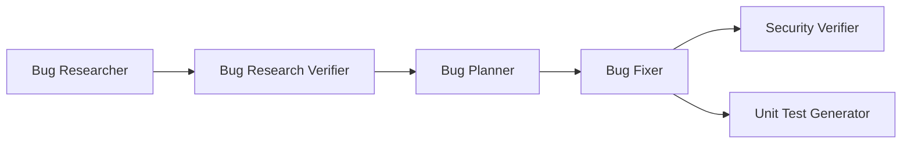

# Homework 4 — 4-Agent Pipeline · Sample Mini Application

**Author / Student:** Oleksandr Tsiupa (`otsiupa48507`, tsiupa.bs@gmail.com)

This homework builds an agent pipeline that finds, verifies, fixes,
security-reviews, and writes regression tests for bugs in a small, self-contained
application. A **single command** runs all stages in order:

```bash
cd homework-4
npm run pipeline          # all bugs (001 002 003)
npm run pipeline 002      # a single bug
```



## The pipeline (6 stages, run by `run-pipeline.sh`)

Each stage runs as a headless Claude Code agent (`claude -p`). The runner loads
the agent's role from `agents/*.agent.md` and, where applicable, auto-injects the
relevant skill from `skills/*.md`. Artifacts flow between stages through
`context/bugs/<ID>/`.

| # | Agent | File | Reads | Writes | Model | Why this model |
|---|-------|------|-------|--------|-------|----------------|
| 1 | Bug Researcher | `agents/bug-researcher.agent.md` | `bug-context.md` | `research/codebase-research.md` | `sonnet` | Codebase exploration is well within Sonnet at lower cost. |
| 2 | Bug Research Verifier | `agents/research-verifier.agent.md` | `codebase-research.md` + source | `research/verified-research.md` | `opus` | Quality gate — a wrong PASS poisons every later stage; strongest reasoning justified. |
| 3 | Bug Planner | `agents/bug-planner.agent.md` | `verified-research.md` | `implementation-plan.md` | `sonnet` | Turning certified findings into exact edits is structured work. |
| 4 | Bug Fixer | `agents/bug-fixer.agent.md` | `implementation-plan.md` | `fix-summary.md` (+ edits `src/`) | `haiku` | Mechanical application of a precise plan; fast/cheap, gated by tests. |
| 5 | Security Verifier | `agents/security-verifier.agent.md` | `fix-summary.md` + changed code | `security-report.md` | `opus` | Adversarial security review; missed vulns are high-cost. |
| 6 | Unit Test Generator | `agents/unit-test-generator.agent.md` | `fix-summary.md` + changed code | `test-report.md` (+ tests) | `sonnet` | Good test generation needs solid coding ability, not deepest reasoning. |

**Skills used:** the Research Verifier applies
[`skills/research-quality-measurement.md`](./skills/research-quality-measurement.md)
(quality levels L0–L4); the Unit Test Generator applies
[`skills/unit-tests-FIRST.md`](./skills/unit-tests-FIRST.md) (Fast, Independent,
Repeatable, Self-validating, Timely).

> Tasks 1–4 cover the four required agents (Research Verifier, Bug Fixer,
> Security Verifier, Unit Test Generator). The pipeline also includes a **Bug
> Researcher** and **Bug Planner** — these are referenced in the TASKS.md run
> order but not specified, so they follow a common research → plan → fix design.

## The application — Doctor Appointment Queue API

## The application — Doctor Appointment Queue API

A minimal REST API that registers patients in a queue for a doctor's
appointment, derived from [`INITIATIVE.md`](./INITIATIVE.md).

| Endpoint | Description |
|----------|-------------|
| `POST /appointments` | Patient sends `{ "name", "reason" }`; receives a `ticketNumber` and a 30-minute `timeSlot`. Clinic hours 09:00–16:00. |
| `POST /queue/next` | Doctor (authenticated via `x-doctor-token`) gets the first waiting patient and removes them from the queue. |
| `GET /` | Health check (`{ status, queueSize }`). |

**Stack:** Node.js (≥20), zero runtime dependencies — built-in `node:http` for
the server and `node:test` for the suite.

```
homework-4/
├── run-pipeline.sh    # single-command runner (npm run pipeline)
├── agents/            # 6 agent definitions (*.agent.md, model in frontmatter)
├── skills/
│   ├── research-quality-measurement.md
│   └── unit-tests-FIRST.md
├── src/
│   ├── server.js      # HTTP server, routing, doctor auth
│   ├── queue.js       # in-memory patient queue
│   └── scheduler.js   # 30-minute slot allocation (09:00–16:00)
├── tests/
│   └── api.test.js    # before-state happy-path tests
├── context/bugs/
│   ├── 001/  # FIFO violation        -> research/, plan, fix, security, test
│   ├── 002/  # closing-time boundary -> (same per-bug artifacts)
│   └── 003/  # insecure doctor auth  -> (same per-bug artifacts)
└── docs/screenshots/
```

## Seeded defects (before pipeline run)

The app intentionally contains **2 bugs** and **1 security issue** for the
pipeline to find and fix — each documented as a separate report under
`context/bugs/`:

1. **FIFO violation** (`src/queue.js`) — the doctor is served the *last*
   registered patient instead of the first (`pop()` instead of `shift()`).
   See [`context/bugs/001/bug-context.md`](./context/bugs/001/bug-context.md).
2. **Boundary error** (`src/scheduler.js`) — a slot at `16:00–16:30` is handed
   out past closing time (`<=` instead of `<`).
   See [`context/bugs/002/bug-context.md`](./context/bugs/002/bug-context.md).
3. **Insecure authentication** (`src/server.js`) — hardcoded doctor token in
   source, compared with a timing-unsafe `===`.
   See [`context/bugs/003/bug-context.md`](./context/bugs/003/bug-context.md).

The before-state tests cover happy paths only, so `npm test` is **green** while
the bugs remain latent on edge cases. After the pipeline runs, the fixes are
applied and the Unit Test Generator adds tests that cover all three issues.

## Run & test

See [`HOWTORUN.md`](./HOWTORUN.md). In short:

```bash
cd homework-4
npm start     # starts the API on http://localhost:3000
npm test      # runs the test suite
```

## Status

- [x] **Task 5** — Sample mini application with seeded defects
- [x] **Tasks 1–4** — the four required agents + Bug Researcher & Bug Planner
- [x] **Skills** — `research-quality-measurement.md`, `unit-tests-FIRST.md`
- [x] **Single-command pipeline** — `npm run pipeline` (`run-pipeline.sh`)
- [ ] **Pipeline execution artifacts** — run `npm run pipeline` to generate
      `verified-research.md`, `fix-summary.md`, `security-report.md`,
      `test-report.md` per bug, apply the fixes, and capture screenshots
