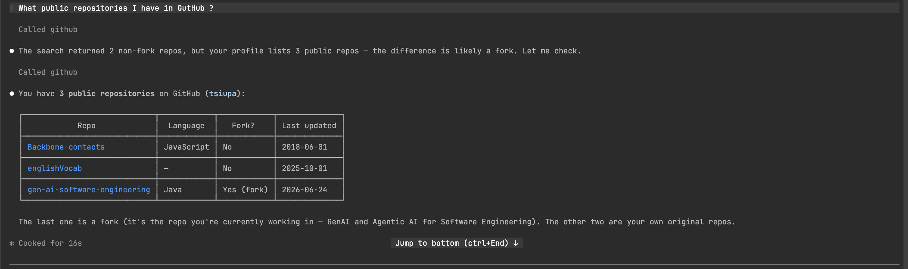
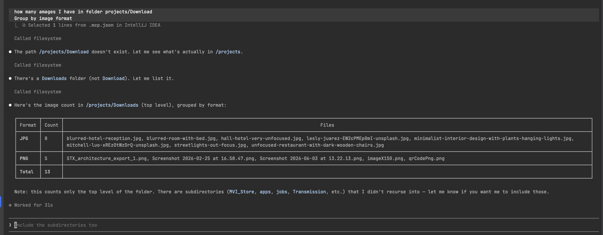
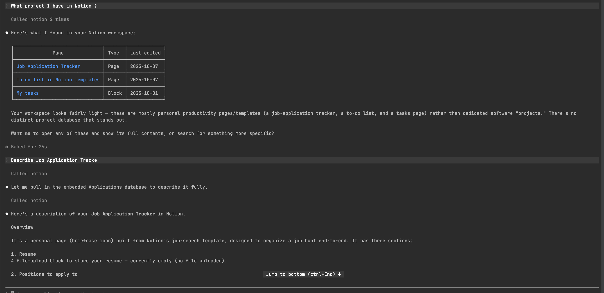
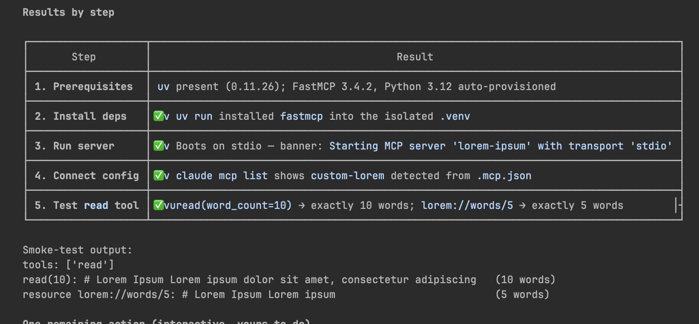
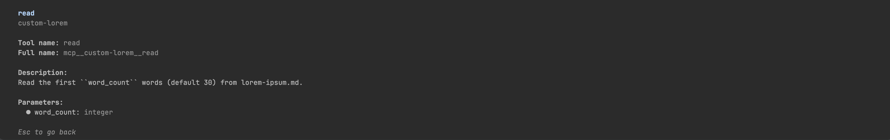
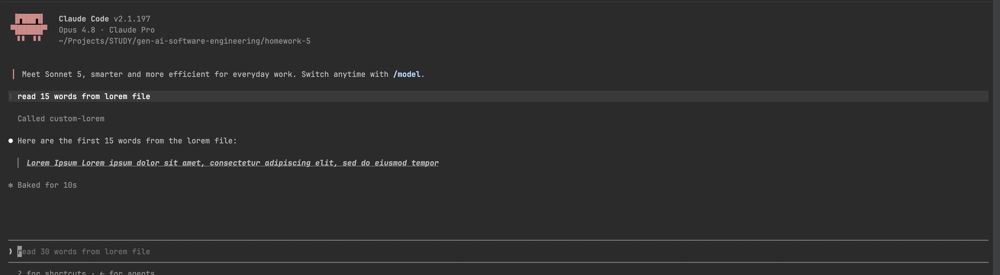

# Homework 5 — Configure MCP Servers

**Author:** Oleksandr Tsiupa

Configured **three external MCP servers** (GitHub, Filesystem, Notion) and built
**one custom MCP server** with FastMCP, all wired into Claude Code via
[`.mcp.json`](.mcp.json). Every server was verified with a real interaction,
captured as a screenshot in [`docs/screenshots/`](docs/screenshots/).

| # | Server | Type | What it does |
|---|--------|------|--------------|
| 1 | **GitHub** | remote HTTP | Query repos, PRs, issues, commits |
| 2 | **Filesystem** | Docker (stdio) | Read a local directory (`~/Downloads` → `/projects/Downloads`) |
| 3 | **Notion** | remote HTTP | Query Notion pages/databases |
| 4 | **custom-lorem** | local FastMCP (stdio) | Custom server: word-limited text from `lorem-ipsum.md` |

All four are registered and connected — the `/mcp` panel shows them live:


---

## GitHub MCP

Connected Claude to GitHub through the official GitHub MCP server (remote HTTP
endpoint `https://api.githubcopilot.com/mcp` with a `Bearer` token). Registered,
connected, and exposing 44 tools.

Asked *"What public repositories I have in GitHub?"* — Claude called the GitHub MCP,
cross-checked the profile count against the search results, and returned the three
public repos (`Backbone-contacts`, `englishVocab`, `gen-ai-software-engineering`)
with language, fork status, and last-updated date.



---

## Filesystem MCP

Connected Claude to a local directory through the Filesystem MCP server, run as a
Docker container over stdio. `~/Downloads` is bind-mounted into the container as
`/projects/Downloads`. Registered, connected, and exposing 11 tools.

Asked *"How many images I have in folder Downloads, grouped by image format?"* —
Claude listed the directory and returned a count grouped by format (8 JPG, 5 PNG,
13 total) with the matching filenames.



---

## Notion MCP

Connected Claude to Notion through the remote MCP server
(`https://mcp.notion.com/mcp`). Registered, connected, and exposing 18 tools.

The homework asks for *"the tickets/pages of the last 5 bugs on a project."* This is
a personal Notion workspace with no bug database, so the equivalent request —
*"What project I have in Notion?"* — was made instead. Claude queried Notion twice
and returned the most recently edited pages (`Job Application Tracker`, `To do list
in Notion templates`, `My tasks`) with type and last-edited date, then described the
`Job Application Tracker` page in detail. Only page titles and dates are shown to
avoid exposing sensitive content.



---

## Custom FastMCP server

Built a custom server in [`custom-mcp-server/`](custom-mcp-server/):

- **[`server.py`](custom-mcp-server/server.py)** — FastMCP server named `lorem-ipsum`.
  - **Resource** `lorem://words` — first 30 words of `lorem-ipsum.md`.
  - **Resource template** `lorem://words/{word_count}` — first N words.
  - **Tool** `read(word_count=30)` — returns the word-limited content.
- **`lorem-ipsum.md`** — source text the resource/tool reads from.
- **`pyproject.toml`** / **`requirements.txt`** — dependencies (both include `fastmcp`).
- **[`HOWTORUN.md`](custom-mcp-server/HOWTORUN.md)** — install, run, connect, and test instructions.

It is registered in `.mcp.json` as `custom-lorem`, launched with
`uv run --directory custom-mcp-server python server.py`.

### Resources vs. Tools

- **Resources** are URIs Claude can *read from* (files, APIs, dynamic content).
- **Tools** are actions Claude can *call* to perform operations (read a file,
  run a command).

### Verification (all passing)

Verified the setup step by step: `uv` provisions FastMCP 3.4.2 and Python 3.12 into
an isolated `.venv`; the server boots on stdio (`Starting MCP server 'lorem-ipsum'
with transport 'stdio'`); `claude mcp list` detects `custom-lorem` from `.mcp.json`;
and both entry points return exactly the requested word count
(`read(word_count=10)` → 10 words, `lorem://words/5` → 5 words).



The `read` tool as Claude sees it (`mcp__custom-lorem__read`, one `word_count`
integer parameter):



Called it from Claude Code — *"read 15 words from lorem file"* returned exactly
15 words:



See [`custom-mcp-server/HOWTORUN.md`](custom-mcp-server/HOWTORUN.md) for full setup details.

---

## Project structure

```
homework-5/
├── README.md                     (this file — description and author)
├── .mcp.json                     (all four servers registered)
├── custom-mcp-server/
│   ├── server.py                 (custom FastMCP server)
│   ├── lorem-ipsum.md            (source text for resource/tool)
│   ├── pyproject.toml            (deps, includes fastmcp)
│   ├── requirements.txt          (deps, includes fastmcp)
│   └── HOWTORUN.md               (install, run, connect, usage)
└── docs/
    └── screenshots/
        ├── 1-all MCPs.png                    (all 4 servers connected)
        ├── 2-github-mcp-result.png           (GitHub)
        ├── 3-notion-mcp-result.png           (Notion)
        ├── 4-filesystem-mcp-result.png       (Filesystem)
        ├── 5make-custom-mcp.png              (custom server — verification)
        ├── 6-custom-mcp-read-tool.png        (custom server — read tool)
        └── 7-custom-mcp-read-tool-result.png (custom server — read result)
```
